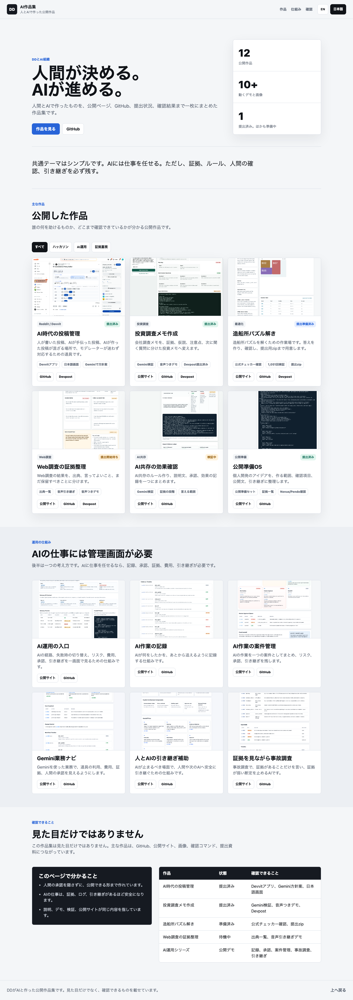

# DD AI Product Portfolio

A concise public portfolio for DD's human-AI product work.

Primary Vercel site:

```text
https://ai-revenue-portfolio.vercel.app
```

GitHub Pages mirror:

```text
https://daideguchi.github.io/ai-revenue-portfolio/
```

Public repository:

```text
https://github.com/daideguchi/ai-revenue-portfolio
```

## 日本語でひとことで

これは、DDがAIと作った公開作品を一枚で見られるページです。

何を作ったのか、誰の役に立つのか、どこまで確認できているのか、公開サイトやGitHubがどこにあるのかをまとめています。

## What This Is

This is a simple review hub for products built through a human-AI collaboration workflow.

The point is not to look busy. The point is to make the work understandable in 30 seconds:

- what was built
- who it helps
- what proof exists
- where the public demo lives
- what is already submitted
- what is queued for the next submission window

## Portfolio Thesis

```text
Human decides. AI ships.
```

AI should do real work, but serious work needs evidence, boundaries, review, handoff, and visible human decision points.

日本語:

```text
人間が決める。AIが進める。
```

AIには実務を進めさせる。ただし、証拠・境界・レビュー・引き継ぎ・人間の判断点を必ず見える形に残す。

## Featured Products

| Product | Status | Public proof |
| --- | --- | --- |
| Coexistence Console | Submitted | Devvit app, Gemini policy drafts, Japanese UI |
| Investor Diligence War Room | Submitted | Live app, Gemini proof, narrated demo, Devpost |
| Shipyard Solver Lab | Ready package | Official checker smoke, 1,051 benchmark runs, candidate submission zip |
| Live Web Evidence Agent | Submit window locked | Source ledger, claim boundary, voice handoff, narrated demo |
| Coexistence Impact Engine | Proof stage | Gemini proof, evidence ladder, claim-boundary checks |
| Shiproom OS | Submitted | Launch packet, evidence ledger, Novus/Pendo proof |
| Resilient AgentOps Gateway | Public demo | Routing, fallback, cost, risk, approval, handoff proof |
| AgentOps Flight Recorder | Public demo | Splunk-ready event timeline and evidence trace |
| AgentOps Case Control Room | Public demo | UiPath-style governed case and approval workflow |
| Gemini Operations Navigator | Public demo | MCP-style tool trace, cost guardrail, human approval |
| Human-AI Handoff Copilot | Public demo | Required-field handoff packet and resume proof |
| Evidence-Locked DFIR Agent | Public demo | Evidence-cited incident claims and unsupported-claim blocking |

## Screenshot

The verification script generates the latest full-page screenshot:

```text
media/portfolio-full.png
```



## Language Support

The site includes a small language switch:

- English
- Japanese

It is intentionally lightweight. The project cards stay compact, while the most important framing text switches language.

## Run Locally

Open `index.html` directly, or serve it with any local static server.

```bash
python3 -m http.server 4177
```

Then open:

```text
http://127.0.0.1:4177/
```

## Verify

```bash
npm install
npm run verify
```

Expected result:

```text
portfolio_verify_ok
```

The verifier checks:

- required product names are visible
- at least 10 project cards exist
- at least 10 screenshots load
- Japanese mode works
- the hackathon filter shows 6 cards and hides 6 cards
- a fresh `media/portfolio-full.png` screenshot is generated

Verify the production Vercel deployment:

```bash
npm run verify:vercel
```

Expected result:

```text
portfolio_verify_ok url=https://ai-revenue-portfolio.vercel.app
```

## Claim Boundary

This portfolio intentionally avoids inflated claims.

It links to public apps, repositories, demos, screenshots, verifiers, and submission packages. If a product is submitted, queued, proof-stage, or not yet final-submitted, the site says so plainly.

## Main Links

- GitHub profile: https://github.com/daideguchi
- Primary Vercel site: https://ai-revenue-portfolio.vercel.app
- GitHub Pages mirror: https://daideguchi.github.io/ai-revenue-portfolio/
- Investor Diligence War Room: https://daideguchi.github.io/investor-diligence-war-room/
- Shipyard Solver Lab: https://daideguchi.github.io/shipyard-solver-lab/
- Live Web Evidence Agent: https://daideguchi.github.io/live-web-evidence-agent/
- Coexistence Impact Engine: https://daideguchi.github.io/coexistence-impact-engine/
- Coexistence Console: https://github.com/daideguchi/coexistence-console
